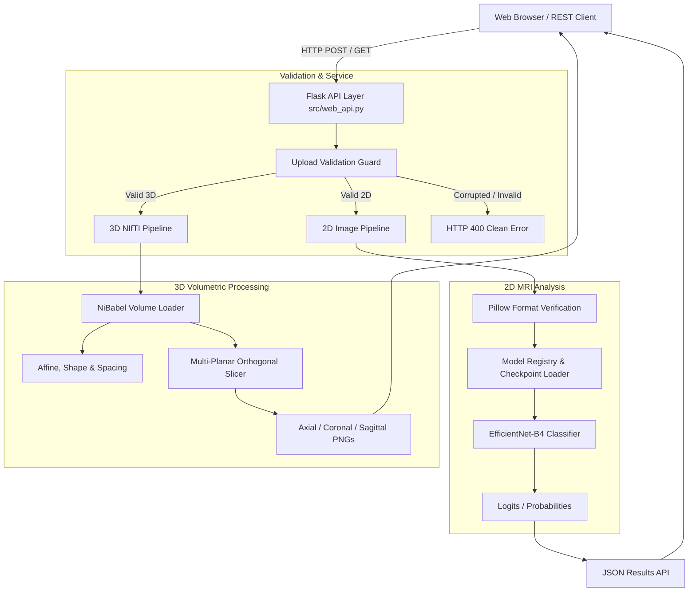

# NeuroVR / STAAR

> A research-oriented Brain MRI analysis and visualization prototype supporting 2D MRI workflows and 3D NIfTI volume exploration.

[](https://www.python.org/)
[](https://flask.palletsprojects.com/)
[](https://pytorch.org/)
[](LICENSE)
[]()

---

## ⚠️ Academic Research & Educational Prototype Notice

> **IMPORTANT NOTICE:**  
> The NeuroVR / MAJOR system is an academic research and engineering prototype developed for educational demonstration purposes as a B.Tech CSE major project. It is **not** a certified medical device or clinical diagnostic tool. It must **not** be used as a substitute for professional medical diagnosis, patient management, or clinical decision-making without expert radiological validation.

---

## 📖 Table of Contents

- [Project Overview](#-project-overview)
- [Key Features](#-key-features)
- [Application Screenshots](#-application-screenshots)
  - [Dashboard & Environment](#1-application-dashboard)
  - [2D Brain MRI Workflow](#2-2d-brain-mri-workflow)
  - [3D NIfTI Volumetric Workflow](#3-3d-nifti-volumetric-workflow)
  - [Multi-Planar MRI Visualization](#4-multi-planar-orthogonal-slice-viewer)
  - [Input Validation & Error Handling](#5-input-validation--safe-error-handling)
- [System Architecture](#-system-architecture)
- [Project Structure](#-project-structure)
- [Supported Inputs](#-supported-inputs)
- [Installation & Setup](#-installation--setup)
- [Running the Application](#-running-the-application)
- [Testing & Quality Assurance](#-testing--quality-assurance)
- [Project Inputs Directory](#-project-inputs-directory)
- [API Overview](#-api-overview)
- [Technology Stack](#-technology-stack)
- [Scope & Known Limitations](#-scope--known-limitations)
- [Future Work](#-future-work)
- [License](#-license)

---

## 🔬 Project Overview

Magnetic Resonance Imaging (MRI) analysis requires rigorous file validation, support for diverse imaging dimensions, and intuitive visualization across multiple anatomical orientations. 

**NeuroVR / STAAR** bridges the gap between conventional 2D slice classification and volumetric 3D neuroimaging exploration:
- **2D Workflows:** Ingests individual slice scans (`.jpg`, `.jpeg`, `.png`), validates pixel resolutions, and maps them to an EfficientNet-B4 multiclass classification pipeline (*Glioma*, *Meningioma*, *No Tumor*, *Pituitary Tumor*).
- **3D Workflows:** Reads uncompressed (`.nii`) and gzip-compressed (`.nii.gz`) NIfTI neuroimaging volumes, extracts physical affine matrices and voxel spacings, and generates orthogonal multi-planar reconstructions (*Axial*, *Coronal*, *Sagittal*).
- **Transparent Execution:** Features honest capability boundaries. When machine learning model weights are not actively loaded, the application explicitly reports `status: "unavailable"` rather than simulating false diagnostic predictions.

---

## ⚡ Key Features

### 2D Brain MRI Workflow
- **File Validation:** Automated verification using Pillow (`RGB`, $512 \times 512$ dimensions, header integrity).
- **Classification Engine:** EfficientNet-B4 architecture configured for 4 diagnostic classes.
- **Dynamic Device Selection:** Automatic hardware acceleration (Apple Silicon MPS, NVIDIA CUDA, or CPU fallback).

### 3D Volumetric NIfTI Workflow
- **Medical Format Ingestion:** Full native parsing of `.nii` and `.nii.gz` volumes via NiBabel.
- **Physical Metadata Extraction:** Automatic computation of voxel dimensions ($mm$), volume shape, and standard anatomical orientation (e.g., RAS, LAS).
- **Dynamic Orthogonal Slicing:** Dynamic slice extraction with 8-bit min-max intensity normalization across all three canonical planes.

### Robust Error Handling & Security
- **Strict Input Validation:** Graceful rejection (`HTTP 400`) of corrupted headers, 0-byte files, and unauthorized file extensions without server crashes.
- **Zero Local Footprint:** Zero hardcoded machine paths, local-only uploads directory, and strict exclusion of sensitive credentials.

---

## 📸 Application Screenshots

All screenshots below represent **actual live application execution** running in the local prototype environment.

### 1. Application Dashboard
The NeuroVR landing interface displays real-time system status, compute device detection, dataset pipeline health, and active hardware status.


---

### 2. 2D Brain MRI Workflow
Users can drag and drop or select 2D MRI scans from `project inputs/2D/`. The file is inspected locally and uploaded. When model checkpoint weights are unmounted, the system transparently indicates that model inference is unavailable rather than fabricating diagnostic results.

<table>
<tr>
<td width="50%" align="center">
<b>Selected 2D MRI Input</b><br><br>

</td>
<td width="50%" align="center">
<b>Validation & Honest State Reporting</b><br><br>

</td>
</tr>
</table>

---

### 3. 3D NIfTI Volumetric Workflow
When a 3D NIfTI volume (such as `mni152.nii.gz`) is uploaded, the backend registers the volume, generates a session volume identifier, and extracts comprehensive physical voxel dimensions.

<table>
<tr>
<td width="50%" align="center">
<b>3D Volume Ingestion & Validation</b><br><br>

</td>
<td width="50%" align="center">
<b>Extracted Volume Metadata</b><br><br>

</td>
</tr>
</table>

---

### 4. Multi-Planar Orthogonal Slice Viewer
The slice viewer provides interactive navigation across all three anatomical planes rendered directly from the uploaded 3D volume.

<table>
<tr>
<td align="center" width="33%">
<b>Axial Plane (Horizontal)</b><br>
<i>Slice 107 / 215</i><br><br>

</td>
<td align="center" width="33%">
<b>Coronal Plane (Frontal)</b><br>
<i>Slice 128 / 256</i><br><br>

</td>
<td align="center" width="33%">
<b>Sagittal Plane (Lateral)</b><br>
<i>Slice 103 / 207</i><br><br>

</td>
</tr>
</table>

---

### 5. Input Validation & Safe Error Handling
Controlled invalid test inputs (such as non-medical text files or corrupted images) are intercepted at the upload boundary, triggering an immediate `HTTP 400 Bad Request` with clear explanatory messages while keeping the service running smoothly.


---

## 🏛️ System Architecture



---

## 📂 Project Structure

```text
major project/
├── app.py                          # Application entry point
├── requirements.txt                # Production dependencies
├── .env.example                    # Environment configuration template
├── LICENSE                         # MIT License
├── README.md                       # Repository documentation
├── config/
│   └── config.yaml                 # Central configuration
├── src/                            # Core backend architecture
│   ├── web_api.py                  # Flask routes and service coordinator
│   ├── volume_loader.py            # NiBabel 3D volume loading & slicing
│   ├── classifier_2d.py            # EfficientNet-B4 classifier implementation
│   ├── model_registry.py           # Model loading & inference coordinator
│   └── utils.py                    # Logging, path handling & device selector
├── web/                            # Frontend interface
│   ├── templates/index.html        # Main dashboard template
│   └── static/
│       ├── css/style.css           # Modern dark-mode interface stylesheet
│       └── js/app.js               # Reactive client-side application logic
├── project inputs/                 # Centralized test inputs directory
│   ├── 2D/                         # Verified 2D MRI scans (glioma, meningioma, etc.)
│   ├── 3D/                         # Verified 3D NIfTI volumes (anatomical, mni152)
│   ├── invalid_inputs/             # Controlled invalid test cases (corrupted, empty)
│   └── TEST_INPUTS_MANIFEST.json   # Machine-readable input index
├── assets/
│   └── screenshots/                # Genuine application screenshots
├── docs/                           # Detailed technical documentation
│   ├── architecture.md             # Subsystem architecture & data flow
│   ├── installation.md             # Setup guide across macOS, Linux & Windows
│   ├── usage.md                    # Web interface and cURL API guide
│   ├── testing.md                  # Test suite and verification guide
│   └── limitations.md              # Scope, constraints & clinical disclaimer
├── tests/                          # Automated unit and integration test suite
└── scripts/                        # Utility & verification scripts
    ├── validate_project_inputs.py  # Input integrity validator
    └── run_step14_verification.py  # End-to-end verification script
```

---

## 📥 Supported Inputs

| Modality | Supported Extensions | Target Dimensions | Purpose |
| :--- | :--- | :--- | :--- |
| **2D Brain MRI** | `.jpg`, `.jpeg`, `.png` | $512 \times 512$ (RGB) | 4-class tumor classification pipeline |
| **3D Volumetric NIfTI** | `.nii` | Multi-slice 3D | Uncompressed anatomical volume analysis |
| **3D Volumetric NIfTI** | `.nii.gz` | Multi-slice 3D | Gzip-compressed volumetric template exploration |

---

## ⚙️ Installation & Setup

### 1. Clone the Repository
```bash
git clone <repository-url>
cd "major project"
```

### 2. Create and Activate Virtual Environment
```bash
# Python 3.11 recommended
python3.11 -m venv .venv

# On macOS / Linux:
source .venv/bin/activate

# On Windows:
.venv\Scripts\activate
```

### 3. Install Dependencies
```bash
pip install --upgrade pip
pip install -r requirements.txt
```

---

## 🚀 Running the Application

Start the local server using the main project entry point:

```bash
# Set Apple Silicon MPS fallback if running on macOS
export PYTORCH_ENABLE_MPS_FALLBACK=1

python app.py
```

- **Local Web Interface:** `http://127.0.0.1:5000/`
- **Health Check Probe:** `http://127.0.0.1:5000/api/health`

---

## 🧪 Testing & Quality Assurance

The repository includes a comprehensive automated test suite and input validation scripts.

### 1. Automated Regression Tests (pytest)
```bash
export PYTORCH_ENABLE_MPS_FALLBACK=1
python -m pytest tests/ -q
```
> **Latest local verification:** `143 passed in 5.24s`

### 2. Project Input & Slice Verification
```bash
python scripts/validate_project_inputs.py
```
> **Latest local verification:** `✓ PROJECT INPUTS VALID` (12 2D images, 2 3D volumes, and all checksums verified).

### 3. End-to-End Live API Demonstration
```bash
python scripts/run_step14_verification.py
```
> **Latest local verification:** Verified 12 public REST API routes, 2D uploads, 3D volume slicing, and error handling.

---

## 📁 Project Inputs Directory

The project includes a dedicated testing folder in [`project inputs/`](project%20inputs):
- **`2D/`**: 12 verified real MRI scans ($512 \times 512$ JPEG, 3 per class: `glioma`, `meningioma`, `notumor`, `pituitary`).
- **`3D/`**: 2 real reference NIfTI volumes (`anatomical.nii` and `mni152.nii.gz`).
- **`invalid_inputs/`**: Safe invalid files (`unsupported_file.txt`, `corrupted_image.jpg`, `empty_volume.nii`) for validating error barriers.
- **`TEST_INPUTS_MANIFEST.json`**: Authoritative manifest storing SHA-256 hashes, shapes, and expected behaviors.

---

## 🌐 API Overview

The Flask backend exposes clean, RESTful endpoints:

| Endpoint | Method | Purpose | Typical Response |
| :--- | :--- | :--- | :--- |
| `/api/health` | `GET` | Health check probe | `{"status": "ok", "service": "neurovr"}` |
| `/api/system/status` | `GET` | Hardware, compute device & directory status | `{"compute_device": "mps", ...}` |
| `/api/upload` | `POST` | Upload and validate 2D image or 3D volume | `{"status": "uploaded", "upload": {...}}` |
| `/api/analyze` | `POST` | Execute classification analysis on upload | `{"status": "unavailable", ...}` |
| `/api/volume/<id>/metadata` | `GET` | Fetch volume dimensions, spacing & orientation | `{"shape": [207, 256, 215], ...}` |
| `/api/volume/<id>/slice/<axis>/<idx>` | `GET` | Stream PNG slice along `axial`, `coronal`, or `sagittal` | `image/png` binary stream |
| `/api/models/status` | `GET` | Inspect model registry and checkpoint statuses | `{"classification": {...}}` |

---

## 🛠️ Technology Stack

- **Core Backend:** Python 3.11, Flask, Werkzeug
- **Deep Learning & Imaging:** PyTorch 2.14, NiBabel (NIfTI processing), Pillow (2D image processing), NumPy, SciPy
- **Frontend Layer:** Semantic HTML5, Vanilla CSS3 (Custom responsive dark theme), Modern JavaScript (ES Modules, Canvas API, Three.js)
- **Quality Assurance:** pytest, Playwright (for real screenshot capture)

---

## ⚠️ Scope & Known Limitations

1. **Research Prototype:** This project is an academic prototype designed to demonstrate software engineering and medical image processing pipelines.
2. **Model Weights Separation:** High-capacity model checkpoints are excluded from Git to respect repository size constraints. The application transparently marks model output as `unavailable` when weights are absent.
3. **Volumetric Visualization:** Displaying orthogonal slices of reference brain volumes does not imply or fabricate tumor segmentation.
4. **Non-Persistent In-Memory State:** Uploaded volume session IDs are held in memory during the active Flask process.

---

## 🔮 Future Work

- **3D BraTS U-Net Segmentation:** Training and integrating full 3D U-Net segmentation weights for whole-tumor, enhancing-core, and edema sub-region masking.
- **Interactive 3D WebXR / VR Mesh Exploration:** Generating surface meshes (`.glb`/`.obj`) from segmented masks for interactive inspection in WebXR headsets.
- **Automated PDF Diagnostic Summaries:** Activating automated report generation once validated segmentation masks are produced.

---

## 📄 License

This project is licensed under the [MIT License](LICENSE). Third-party medical datasets and reference templates remain subject to their respective original licenses and data use agreements.
