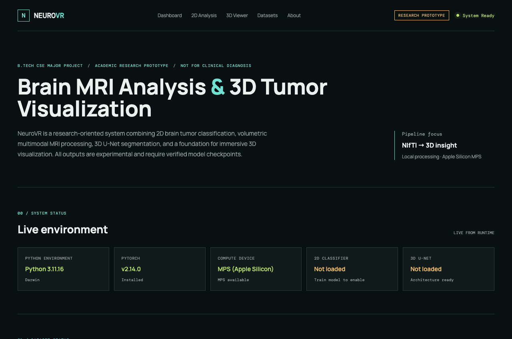
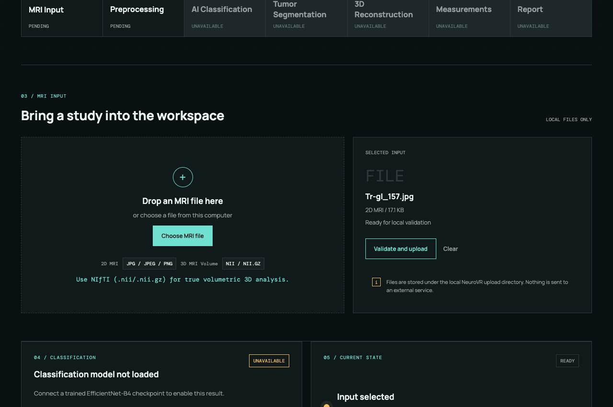
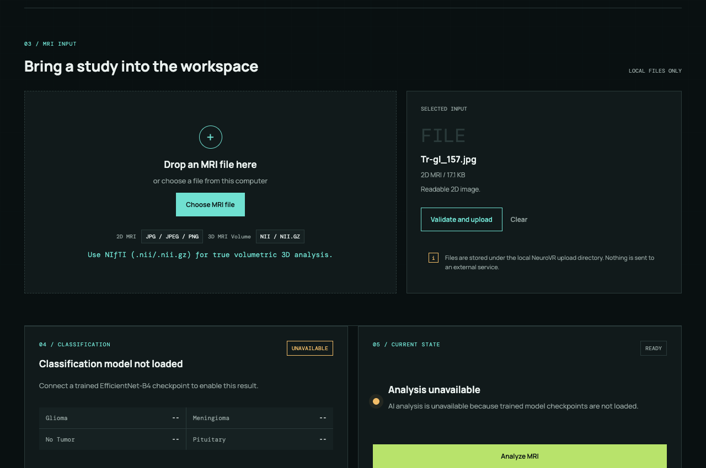
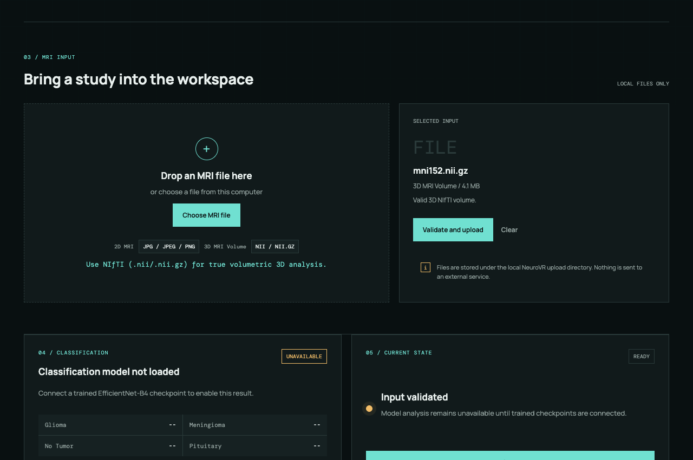
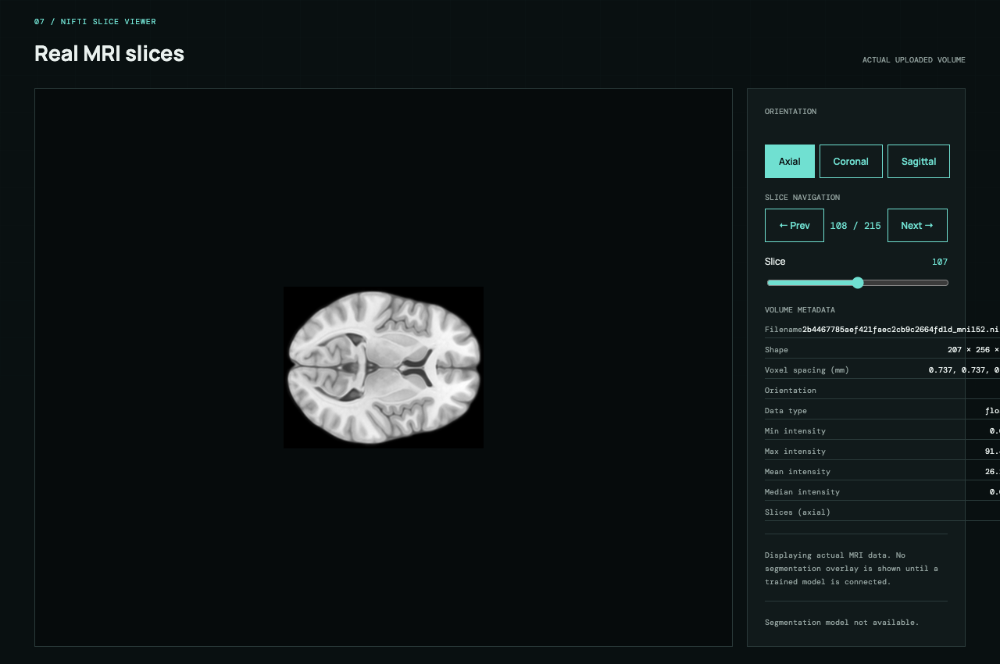
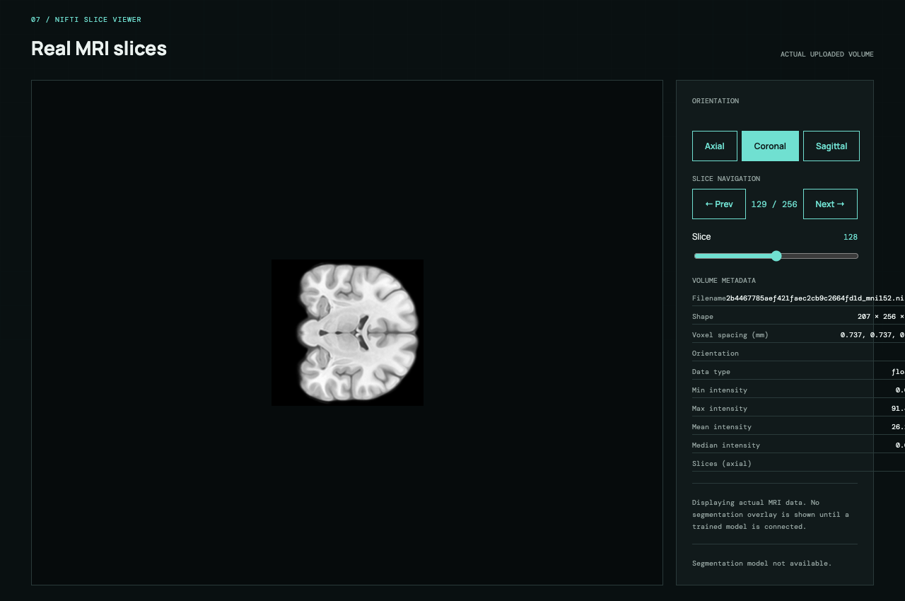
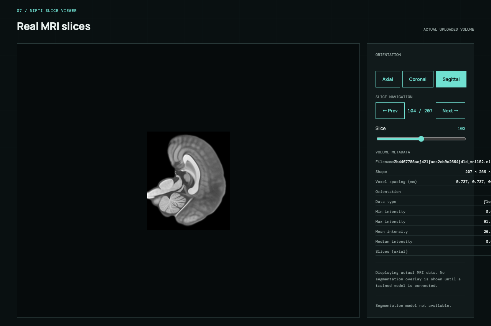
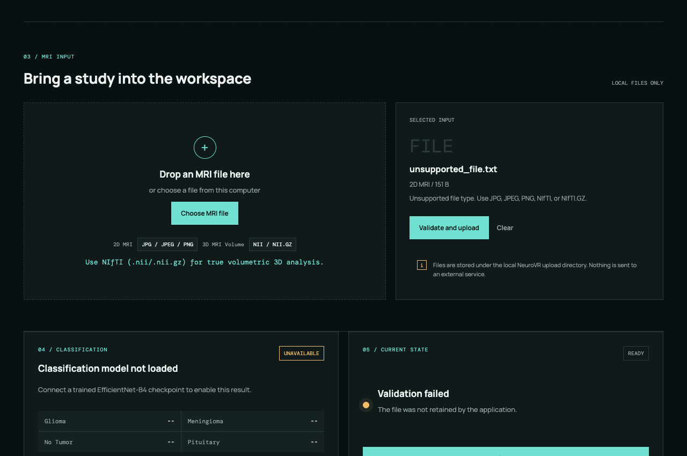
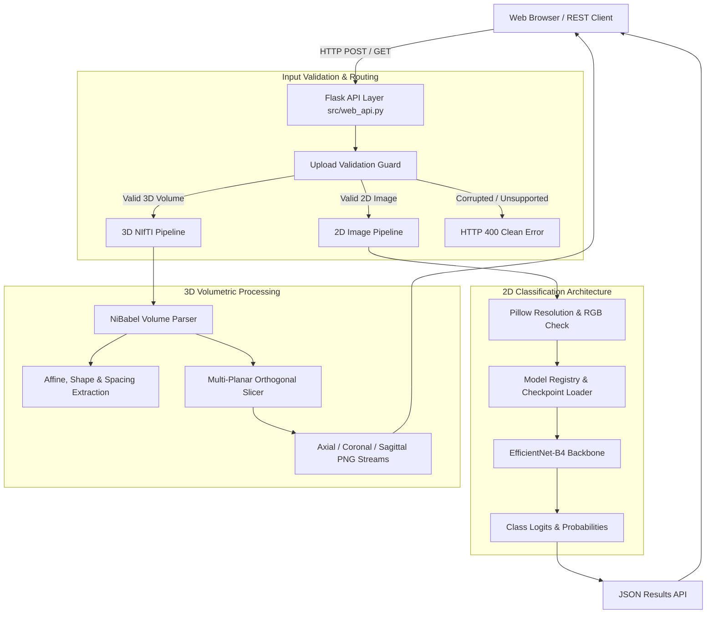

# NeuroVR / STAAR: Brain MRI Analysis & 3D Tumor Visualization

> **Academic Research Prototype — B.Tech Computer Science & Engineering Major Project**  
> A research-oriented system exploring 2D brain MRI classification architecture, volumetric multimodal MRI processing, NIfTI orthogonal slice exploration, and foundational spatial visualization workflows.

[](https://www.python.org/)
[](https://flask.palletsprojects.com/)
[](https://pytorch.org/)
[](LICENSE)
[]()

---

## ⚠️ Academic Research & Educational Prototype Disclaimer

> **IMPORTANT DISCLAIMER:**  
> NeuroVR is a B.Tech Computer Science and Engineering academic research prototype.
>
> It is **NOT**:
> - A clinically validated medical device
> - A diagnostic tool
> - A substitute for radiologist or physician interpretation
>
> All workflows, architectures, models, and measurements are developed strictly for educational demonstration, engineering evaluation, and computational research evaluation.

---

## 📖 Table of Contents

- [Project Overview](#-project-overview)
- [Feature Status Model & Capability Breakdown](#-feature-status-model--capability-breakdown)
  - [Feature Status Matrix](#feature-status-matrix)
  - [Currently Available](#currently-available)
  - [Requires Additional Resources](#requires-additional-resources)
  - [Research Pipeline Features](#research-pipeline-features)
- [Application Screenshots (From Live System)](#-application-screenshots-from-live-system)
  - [1. Dashboard & Live Environment](#1-dashboard--live-environment)
  - [2. Dataset Pipelines Status](#2-dataset-pipelines-status)
  - [3. 2D Brain MRI Input & Classification State](#3-2d-brain-mri-input--classification-state)
  - [4. Real Dataset Sample Browser](#4-real-dataset-sample-browser)
  - [5. 3D NIfTI Volume Loading & Metadata](#5-3d-nifti-volume-loading--metadata)
  - [6. Multi-Planar Orthogonal Slice Viewer](#6-multi-planar-orthogonal-slice-viewer)
  - [7. 3D Spatial Visualization Workspace](#7-3d-spatial-visualization-workspace)
  - [8. Quantitative Analysis Architecture](#8-quantitative-analysis-architecture)
  - [9. Safe Input Validation & Error Handling](#9-safe-input-validation--error-handling)
- [System Architecture](#-system-architecture)
- [Project Directory Structure](#-project-directory-structure)
- [Supported Medical Imaging Formats](#-supported-medical-imaging-formats)
- [Installation & Setup](#-installation--setup)
- [Running the Application](#-running-the-application)
- [Testing & Quality Assurance](#-testing--quality-assurance)
- [Project Inputs Directory](#-project-inputs-directory)
- [REST API Overview](#-rest-api-overview)
- [Technology Stack](#-technology-stack)
- [Research Literature & References](#-research-literature--references)
- [Honest Scope & Limitations](#-honest-scope--limitations)
- [Future Roadmap](#-future-roadmap)
- [License & Ethical Compliance](#-license--ethical-compliance)

---

## 🔬 Project Overview

Neuroimaging analysis involves distinct challenges ranging from multi-slice 2D MRI classification to high-dimensional volumetric NIfTI exploration. 

**NeuroVR / STAAR** was built to investigate and demonstrate a clean, unified engineering framework for:
1. **2D MRI Workflows:** Handling slice scans (`.jpg`, `.jpeg`, `.png`), performing integrity validation, and integrating with an EfficientNet-B4 classification architecture designed for 4 classes (*Glioma*, *Meningioma*, *No Tumor*, *Pituitary*).
2. **3D Volumetric Exploration:** Parsing uncompressed (`.nii`) and gzip-compressed (`.nii.gz`) NIfTI volumes, reading physical voxel spacing and coordinate affine matrices, and rendering orthogonal slice planes (*Axial*, *Coronal*, *Sagittal*).
3. **Engineering Transparency:** Upholding strict honesty. When trained deep learning model weights are unmounted, the interface and API explicitly state that model inference is unavailable (`HTTP 503`) rather than fabricating diagnostic results.

---

## 📊 Feature Status Model & Capability Breakdown

### Feature Status Matrix

| Feature | Status | Requirement | Behavior & Description |
| :--- | :---: | :--- | :--- |
| **2D EfficientNet-B4 Inference** | ⚠️ **Requires Checkpoint** | Compatible trained model checkpoint | Supported by application architecture and model registry. When unmounted, UI displays *"Classification model not loaded. Connect a trained EfficientNet-B4 checkpoint to enable analysis."* and API returns `HTTP 503`. |
| **3D BraTS U-Net Segmentation** | ⚠️ **Not Imported** | Dataset / model resources must be imported | 3D U-Net baseline architecture implemented; BraTS benchmark data and trained segmentation checkpoints are not currently imported into this environment. |
| **3D Medical Mesh Rendering** | ⚠️ **Requires Mask** | Valid segmentation mask | Three.js viewport and controls are ready. Medical brain and tumor meshes require a verified segmentation mask before rendering. UI displays *"3D tumor mesh unavailable"*. Synthetic test geometry is labelled as demo object. |
| **Quantitative Measurements** | ⚠️ **Requires Mask** | Verified segmentation mask | Tumor volume ($mm^3$ / $cm^3$), voxel count, centroid, spatial bounding box, and Dice/IoU read *"Not available"* until a verified segmentation mask exists. |
| **Visual Evidence Overlays** | ⚠️ **Requires Analysis** | Valid analysis output | Tabs for Binary Mask, Tumor Overlay, Tumor Contour, and JET Heatmap activate only when valid model analysis outputs are available. |
| **Medical PDF Report Export** | ⚠️ **Requires Analysis** | Verified completed analysis | Guarded endpoint returning `HTTP 503` (`analysis_required`) until verified analysis results exist. |

### Currently Available
- Local NeuroVR web interface
- MRI upload
- JPG / JPEG / PNG support
- NIfTI (`.nii` / `.nii.gz`) support
- Dataset sample display (real verified scans from `data/classification/`)
- NIfTI volume loading & memory registration
- Axial slice viewing (dynamic intensity normalization)
- Coronal slice viewing
- Sagittal slice viewing
- Slice navigation (sliders, stepping buttons, counters)
- Volume metadata extraction (shape, spacing, orientation, intensity stats)
- 3D visualization workspace (Three.js viewport, camera controls, orbit controls, fullscreen, reset)
- Pipeline architecture & model registry integration

### Requires Additional Resources
- EfficientNet-B4 trained checkpoint (`checkpoints/classification/best.pt`)
- 3D segmentation checkpoint (`checkpoints/segmentation/best.pt`)
- BraTS dataset / resources
- Verified segmentation masks
- Model analysis inference outputs

### Research Pipeline Features
- Tumor segmentation
- Medical mesh generation
- Quantitative tumor measurements
- Binary masks
- Tumor overlays
- Contours
- JET heatmaps
- Medical PDF report generation

---

## 📸 Application Screenshots (From Live System)

The following screenshots are unedited captures from the **actual working NeuroVR application** running locally at `http://127.0.0.1:5000`.

### 1. Dashboard & Live Environment
The landing view identifies local runtime specifications, confirms Python 3.11, detects Apple Silicon MPS acceleration, and honestly indicates that model weights are currently not loaded.



---

### 2. Dataset Pipelines Status
The dashboard tracks the state of both data pipelines: **Pipeline A (2D Classification)** is configured with the 4-class Brain Tumor MRI dataset, while **Pipeline B (3D Segmentation)** accurately reports that BraTS multimodal data is not yet imported.

---

### 3. 2D Brain MRI Input & Classification State
Users can upload 2D MRI scans from `project inputs/2D/`. The file is inspected locally. Because checkpoints are not mounted by default, the interface clearly displays **"Classification model not loaded"** and sets the analysis state to *Unavailable* rather than generating fake predictions.

<table>
<tr>
<td width="50%" align="center">
<b>Selected 2D MRI Input (Validated)</b><br><br>

</td>
<td width="50%" align="center">
<b>Classification State (Model Not Loaded)</b><br><br>

</td>
</tr>
</table>

---

### 4. Real Dataset Sample Browser
The interface includes a dedicated sample browser displaying actual, verified brain MRI images loaded from the research dataset for demonstration across all four classes (*Glioma*, *Meningioma*, *No Tumor*, *Pituitary*).

---

### 5. 3D NIfTI Volume Loading & Metadata
Upon uploading a 3D NIfTI volume (e.g., `mni152.nii.gz`), the backend registers the volume, assigns a session volume identifier, and extracts comprehensive physical metrics including volume dimensions ($207 \times 256 \times 215$), voxel spacing ($0.738 \times 0.738 \times 0.738\text{ mm}$), and intensity statistics.

<table>
<tr>
<td width="50%" align="center">
<b>3D NIfTI Volume Upload Panel</b><br><br>

</td>
<td width="50%" align="center">
<b>Extracted Volume Dimensions & Metrics</b><br><br>

</td>
</tr>
</table>

---

### 6. Multi-Planar Orthogonal Slice Viewer
The slice viewer dynamically renders orthogonal 2D PNG slices from the 3D volume along all three anatomical axes, equipped with axis toggles, slider scrubbing, and slice counters:

<table>
<tr>
<td align="center" width="33%">
<b>Axial Plane (Horizontal)</b><br>
<i>Slice 108 / 215</i><br><br>

</td>
<td align="center" width="33%">
<b>Coronal Plane (Frontal)</b><br>
<i>Slice 129 / 256</i><br><br>

</td>
<td align="center" width="33%">
<b>Sagittal Plane (Lateral)</b><br>
<i>Slice 104 / 207</i><br><br>

</td>
</tr>
</table>

---

### 7. 3D Spatial Visualization Workspace
The application incorporates an interactive 3D WebGL/Three.js viewport equipped with orbit, zoom, and pan controls. The interface explicitly notifies the user: **"3D tumor mesh unavailable — Complete segmentation to load a medical mesh"**, ensuring no unverified anatomical geometry is displayed.

---

### 8. Quantitative Analysis Architecture
The quantitative panel outlines metrics designed to be computed from verified masks (tumor volume in $\text{mm}^3$ and $\text{cm}^3$, voxel counts, 3D centroid, bounding box coordinates, and Dice/IoU coefficients). All values correctly read **"Not available"** until a segmentation mask is produced.

---

### 9. Safe Input Validation & Error Handling
Uploading invalid data (such as non-imaging `.txt` files or corrupted image headers) triggers immediate, graceful rejection (`HTTP 400 Bad Request`) with informative diagnostics, safely discarding temporary files without server interruption.



---

## 🏛️ System Architecture



---

## 📂 Project Directory Structure

```text
major project/
├── app.py                          # Flask application launcher
├── requirements.txt                # Python runtime dependencies
├── .env.example                    # Environment template
├── LICENSE                         # MIT License
├── README.md                       # Repository documentation
├── config/
│   └── config.yaml                 # Central system configuration
├── src/                            # Core application source
│   ├── web_api.py                  # REST API and service boundary
│   ├── volume_loader.py            # NiBabel 3D volume loading & orthogonal slicing
│   ├── classifier_2d.py            # EfficientNet-B4 architecture definition
│   ├── model_registry.py           # Model loading & inference coordinator
│   ├── segmenter_3d.py             # 3D U-Net segmentation baseline
│   └── utils.py                    # Device selection, logging & config parser
├── web/                            # Web application frontend
│   ├── templates/index.html        # Main dashboard HTML template
│   └── static/
│       ├── css/style.css           # Responsive dark-theme stylesheet
│       └── js/
│           ├── app.js              # Reactive frontend application logic
│           └── viewer3d.js         # Three.js 3D viewport and orbit controls
├── project inputs/                 # Centralized test inputs directory
│   ├── 2D/                         # Verified 2D MRI scans (3 per class)
│   ├── 3D/                         # Reference NIfTI volumes (anatomical, mni152)
│   ├── invalid_inputs/             # Controlled invalid test cases (corrupted, empty)
│   └── TEST_INPUTS_MANIFEST.json   # Machine-readable test input index
├── assets/
│   └── screenshots/                # Live application screenshots
├── docs/                           # Technical documentation
│   ├── architecture.md             # Subsystem architecture & data flow
│   ├── installation.md             # Setup guide across macOS, Linux & Windows
│   ├── usage.md                    # Web interface and cURL API guide
│   ├── testing.md                  # Test suite and verification guide
│   └── limitations.md              # Scope, constraints & clinical disclaimer
├── tests/                          # 9 unit & integration test modules (143 tests)
└── scripts/                        # Utility & validation scripts
    ├── validate_project_inputs.py  # Input integrity validator
    └── run_step14_verification.py  # End-to-end verification script
```

---

## 📥 Supported Medical Imaging Formats

| Modality | Supported Formats | Target Dimensions | Purpose |
| :--- | :--- | :--- | :--- |
| **2D Brain MRI** | `.jpg`, `.jpeg`, `.png` | $512 \times 512$ (RGB) | 4-class tumor classification pipeline |
| **3D Volumetric NIfTI** | `.nii` | Multi-slice 3D | Uncompressed anatomical volume analysis |
| **3D Volumetric NIfTI** | `.nii.gz` | Multi-slice 3D | Gzip-compressed volumetric template exploration |

---

## ⚙️ Installation & Setup

### 1. Prerequisites
- **Python:** Python 3.11 (Python 3.11.16 recommended)
- **Git:** Standard Git version control
- **Hardware Acceleration:**
  - **macOS:** Apple Silicon MPS natively supported
  - **Linux / Windows:** NVIDIA CUDA supported, with automatic CPU fallback

### 2. Setup Virtual Environment
```bash
git clone https://github.com/Saisuman55/NeuroVR-STAAR.git
cd NeuroVR-STAAR

python3.11 -m venv .venv
source .venv/bin/activate  # On Windows: .venv\Scripts\activate
pip install --upgrade pip
pip install -r requirements.txt
```

---

## 🚀 Running the Application

Start the local server using the main project entry point:

```bash
# Enable Apple Silicon MPS fallback if running on macOS
export PYTORCH_ENABLE_MPS_FALLBACK=1

python app.py
```

- **Local Web Interface:** `http://127.0.0.1:5000/`
- **Health Check Probe:** `http://127.0.0.1:5000/api/health`

---

## 🧪 Testing & Quality Assurance

The repository includes a comprehensive automated test suite and verification scripts:

### 1. Automated Regression Suite (pytest)
```bash
export PYTORCH_ENABLE_MPS_FALLBACK=1
python -m pytest tests/ -q
```
> **Verified Result:** `143 passed in 9.45s`

### 2. Project Input & Multi-Planar Slice Verification
```bash
python scripts/validate_project_inputs.py
```
> **Verified Result:** `✓ PROJECT INPUTS VALID` (12 2D images, 2 3D volumes, and all checksums verified).

### 3. End-to-End Live API Demonstration
```bash
python scripts/run_step14_verification.py
```
> **Verified Result:** Validated all 12 public REST API routes, 2D uploads, 3D volume slicing, and error handling.

---

## 📁 Project Inputs Directory

A dedicated testing folder is organized in [`project inputs/`](project%20inputs):
- **`2D/`**: 12 verified real MRI scans ($512 \times 512$ JPEG, 3 per class: `glioma`, `meningioma`, `notumor`, `pituitary`).
- **`3D/`**: 2 real reference NIfTI volumes (`anatomical.nii` and `mni152.nii.gz`).
- **`invalid_inputs/`**: Safe invalid files (`unsupported_file.txt`, `corrupted_image.jpg`, `empty_volume.nii`) for testing error handling.
- **`TEST_INPUTS_MANIFEST.json`**: Authoritative manifest containing SHA-256 checksums, shapes, and expected behaviors.

---

## 🌐 REST API Overview

| Endpoint | Method | Purpose | Typical Response |
| :--- | :--- | :--- | :--- |
| `/api/health` | `GET` | Health check probe | `{"status": "ok", "service": "neurovr"}` |
| `/api/capabilities` | `GET` | Feature status and capability prerequisites matrix | `{"features": [...], "status": "ok"}` |
| `/api/system/status` | `GET` | Hardware, compute device & directory status | `{"compute_device": "MPS (Apple Silicon)", ...}` |
| `/api/upload` | `POST` | Upload and validate 2D image or 3D volume | `{"status": "uploaded", "upload": {...}}` |
| `/api/analyze` | `POST` | Execute classification analysis on upload | `HTTP 503` `{"status": "requires_checkpoint", ...}` when unmounted; `HTTP 200` with predictions when checkpoint loaded |
| `/api/results` | `GET` | Fetch session analysis results | `{"status": "requires_analysis", ...}` until analysis completes |
| `/api/report` | `POST` | Request medical PDF research report | `HTTP 503` `{"status": "analysis_required", ...}` until analysis completes |
| `/api/volume/<id>/metadata` | `GET` | Fetch volume dimensions, spacing & orientation | `{"shape": [207, 256, 215], ...}` |
| `/api/volume/<id>/slice/<axis>/<idx>` | `GET` | Stream PNG slice along `axial`, `coronal`, or `sagittal` | `image/png` binary stream |
| `/api/models/status` | `GET` | Inspect model registry and checkpoint statuses | `{"classification": {"status": "requires_checkpoint"}}` |

---

## 🛠️ Technology Stack

- **Core Backend:** Python 3.11, Flask 3.0, Werkzeug 3.0
- **Neuroimaging & Compute:** PyTorch 2.14, NiBabel 5.0 (NIfTI processing), Pillow 10.0 (2D image processing), NumPy 1.26, SciPy 1.11
- **Web Frontend:** Semantic HTML5, Vanilla CSS3 (custom dark theme), Modern JavaScript (ES Modules, HTML5 Canvas, Three.js)
- **Quality Assurance:** pytest 8.0, Playwright (for automated screenshot capture)

---

## 📚 Research Literature & References

NeuroVR / STAAR grounds its architectural baselines in foundational peer-reviewed literature across 2D classification, 3D volumetric segmentation, benchmark protocols, and surface reconstruction:

| Ref ID | Authors | Title | Year | Venue | Topic / Architecture | Relevance to NeuroVR |
| :---: | :--- | :--- | :---: | :--- | :--- | :--- |
| **P01** | Tan & Le | *EfficientNet: Rethinking Model Scaling for Convolutional Neural Networks* | 2019 | ICML | EfficientNet compound scaling | Foundational rationale for the 2D classification backbone ([arXiv:1905.11946](https://arxiv.org/abs/1905.11946)) |
| **P02** | Ronneberger et al. | *U-Net: Convolutional Networks for Biomedical Image Segmentation* | 2015 | MICCAI | Encoder-decoder with skip connections | Foundational architecture for biomedical image localization ([arXiv:1505.04597](https://arxiv.org/abs/1505.04597)) |
| **P03** | He et al. | *Deep Residual Learning for Image Recognition* | 2016 | CVPR | Residual learning with shortcut connections | Foundational rationale for ResNet-based feature extractors ([DOI: 10.1109/CVPR.2016.90](https://doi.org/10.1109/CVPR.2016.90)) |
| **P04** | Sudre et al. | *Generalised Dice overlap as a deep learning loss function for highly unbalanced segmentations* | 2017 | DLMIA | Overlap-aware loss for severe label imbalance | Methodological basis for the BCE + Dice loss formulation ([DOI: 10.1007/978-3-319-67558-9_28](https://doi.org/10.1007/978-3-319-67558-9_28)) |
| **P05** | Menze et al. | *The Multimodal Brain Tumor Image Segmentation Benchmark (BRATS)* | 2015 | IEEE TMI | Multimodal brain tumor MRI benchmark | Standardized evaluation context, sub-region definitions, and split protocols ([DOI: 10.1109/TMI.2014.2377694](https://doi.org/10.1109/TMI.2014.2377694)) |
| **P06** | Lorensen & Cline | *Marching Cubes: A High Resolution 3D Surface Construction Algorithm* | 1987 | ACM SIGGRAPH | Isosurface extraction from volumetric grids | Methodological foundation for future 3D mesh surface generation ([DOI: 10.1145/37402.37422](https://doi.org/10.1145/37402.37422)) |
| **P07** | Çiçek et al. | *3D U-Net: Learning Dense Volumetric Segmentation from Sparse Annotation* | 2016 | MICCAI | Volumetric dense 3D convolutions | Primary architecture baseline for NeuroVR's 3D volumetric segmentation ([arXiv:1606.06650](https://arxiv.org/abs/1606.06650)) |
| **P08** | Milletari et al. | *V-Net: Fully Convolutional Neural Networks for Volumetric Medical Image Segmentation* | 2016 | 3DV | Fully convolutional volumetric segmentation & Dice loss | Methodological comparison baseline for 3D medical volume learning ([DOI: 10.1109/3DV.2016.79](https://doi.org/10.1109/3DV.2016.79)) |
| **P09** | Isensee et al. | *nnU-Net: a self-configuring method for deep learning-based biomedical image segmentation* | 2021 | Nature Methods | Self-configuring biomedical segmentation framework | Benchmark comparison context for volumetric preprocessing and spacing ([DOI: 10.1038/s41592-020-01008-z](https://doi.org/10.1038/s41592-020-01008-z)) |
| **P10** | Wang et al. | *TransBTS: Multimodal Brain Tumor Segmentation Using Transformer* | 2021 | MICCAI | CNN encoder + Transformer global context modeling | Reference context for modern multimodal brain tumor segmentation ([arXiv:2103.04430](https://arxiv.org/abs/2103.04430)) |

*Note: For extended literature reviews, dataset analysis, and technical papers, see the full repository references in [`references/papers.md`](references/papers.md).*

---

## ⚠️ Honest Scope & Limitations

1. **Academic Research Prototype:** Developed as a student engineering major project to demonstrate software architecture and neuroimaging pipelines.
2. **Model Weights Separation:** Heavy binary model checkpoints (`checkpoints/*.pt`) are excluded from Git to comply with repository quotas. The application transparently marks classification output as `unavailable` when weights are unmounted.
3. **Volumetric Visualization:** Rendering orthogonal slices of reference brain volumes demonstrates volumetric parsing and dynamic slicing; it does **not** simulate or fabricate tumor segmentation.
4. **Session State:** Uploaded volume session IDs are managed in-memory during the active Flask process.

---

## 🔮 Future Roadmap

- **BraTS 3D U-Net Training:** Importing the BraTS multimodal benchmark dataset and training volumetric segmentation weights.
- **3D Surface Mesh Extraction:** Applying Marching Cubes to generate surface meshes (`.glb`/`.obj`) for interactive exploration in WebXR/Three.js.
- **Automated Clinical Reporting:** Activating PDF diagnostic summaries once validated segmentation masks and volume metrics are produced.

---

## 📄 License & Ethical Compliance

- **Software License:** Licensed under the [MIT License](LICENSE).
- **Data Compliance:** Third-party medical datasets and reference templates remain subject to their respective original licenses and data use agreements. The NeuroVR project claims no ownership over third-party medical imaging data.
